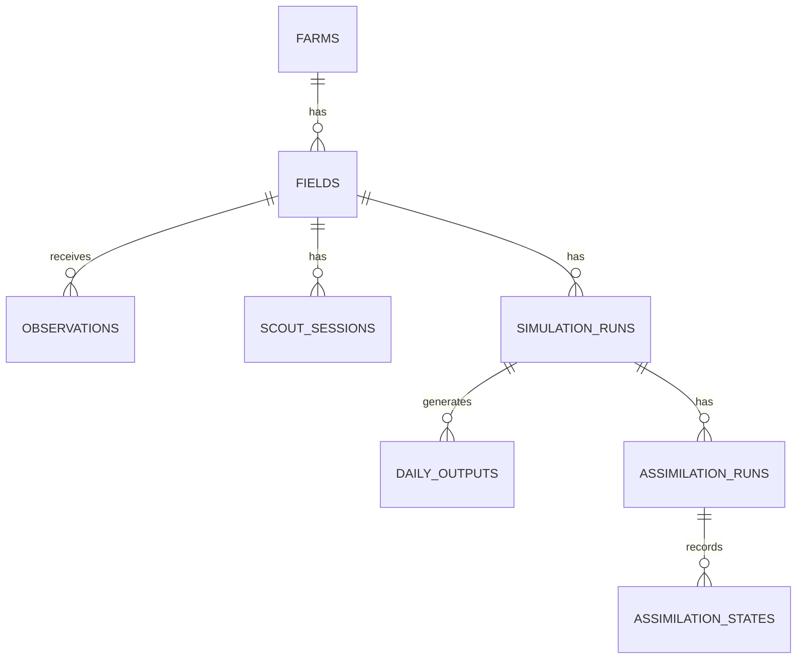

# AgriTwin Developer & LLM Context Specification

This document provides a complete, high-fidelity explanation of the AgriTwin repository's architecture, database design, feature implementation, and key system invariants. Use this file as context for any LLM agent to ensure zero hallucinations, zero missing features, and smooth continuity of development.

---

## 🚀 1. Project Overview & Current System Capabilities

AgriTwin is a Python/FastAPI Agricultural Digital Twin platform. It uses the Wageningen **PCSE/WOFOST 7.2 (Water-Limited Production)** simulation engine to model crop development day-by-day. To prevent drift caused by weather anomalies or uncertain soil hydraulic parameters, AgriTwin ingests satellite, mobile scout, and sensor observations, applies **Module 3.3 Multi-Source Data Fusion**, and executes sequential data assimilation via an **Ensemble Kalman Filter (EnKF)**.

### Operational System Status
*   **Physical Simulation**: PCSE WOFOST 7.2 engine (`Wofost72_WLP_FD`) integrated with daily state output tracking (`DVS`, `LAI`, `TAGP`, `TWSO`, `SM`, `RFTRA`).
*   **Geospatial Grounding**: Automatic API retrieval & local JSON caching (`.agritwin_cache/`) for NASA POWER (daily weather) and ISRIC SoilGrids v2.0 (layered soil textures mapped to hydraulic parameters via pedotransfer equations).
*   **ERA5-Land Integration**: Hybrid weather service routing ERA5-Land reanalysis for historical data (>60 days old) and NASA POWER for recent operational data (<60 days old). Supports 4-layer soil moisture (0–7cm, 7–28cm, 28–100cm, 100–289cm).
*   **Sentinel-2 NDRE Remote Sensing**: 10m resolution Red-Edge Leaf Area Index (LAI) automated fetcher with SCL cloud-masking and cloud-adaptive confidence scoring (0.85 clear $\rightarrow$ 0.0 cloud masked).
*   **W-Shape Smartphone GRVI Protocol**: Mobile field scouting protocol uploading 5 photos in a W-shape pattern across a plot. Extracts EXIF GPS data, computes median RGB Green-Red Vegetation Index ($\text{GRVI} = \frac{G - R}{G + R}$), and converts to LAI with a 30% observation error ($R = 0.30$) serving as a "Gentle Nudge" for EnKF assimilation.
*   **Module 3.3 Data Fusion Pipeline**:
    *   *Temporal Interpolation*: Linear, cubic spline, and Savitzky-Golay interpolation with monsoon cloud-gap detection (>10 days cloud gap triggers `HOLD_OPEN_LOOP`).
    *   *Spatial Alignment*: Aligns point, 10m Sentinel raster, and 11km ERA5-Land grid data to GeoJSON field boundary polygons.
    *   *Confidence Estimator*: Computes observation confidence score and dynamic observation error covariance matrix ($R$).
    *   *Multi-Source Bayesian Fusion*: Merges heterogeneous observation streams into a single weighted LAI/SM estimate.
*   **Sequential EnKF Assimilation**: $N$-member stochastic ensemble manager (perturbing crop parameters, weather, and soil moisture), EnKF math core ($P^f, K, A^a$), non-destructive PCSE state variable updater, quality control filters, and zero-order hold (ZOH) comparative timeseries visualizer.
*   **Deterministic Scenario Engine**: Evaluates sowing date shifts, crop variety parameter sets, and irrigation schedules based on yield (`TWSO`) and Water Use Efficiency (`WUE`).
*   **Database & API Layer**: SQLAlchemy 2.0 ORM + Alembic migrations + FastAPI REST controllers across Simulation, Fields, Scout Sessions, Observations, Satellite, Fusion, Assimilation, and Scenarios.
*   **Demonstration Script**: Fully automated `run_demo.py` script running an end-to-end Rice IR64 baseline simulation vs EnKF assimilation campaign.

---

## 📂 2. Detailed Module & File Architecture

```text
backend/app/
├── main.py                             # FastAPI app instance, CORS middleware, router mounting
├── core/
│   ├── config.py                       # Application settings & environment variables
│   └── exceptions.py                   # Custom exception hierarchy
├── db/
│   ├── base.py                         # SQLAlchemy DeclarativeBase
│   └── session.py                      # Engine creation & get_db dependency
├── models/                             # Core ORM entities
│   ├── farm.py                         # Farm model (parent grouping of fields)
│   ├── field.py                        # Field model (GeoJSON boundary, centroid, elevation)
│   ├── simulation_run.py               # SimulationRun model (open-loop baseline metadata)
│   ├── daily_output.py                 # DailyOutput model (daily WOFOST time series)
│   └── assimilation_run.py             # AssimilationRun model (EnKF loop execution record)
├── repositories/                       # Fast SQL query layer
│   ├── field_repository.py             # CRUD operations for fields
│   ├── simulation_repository.py        # CRUD operations for simulation runs
│   └── daily_output_repository.py      # Mass daily output bulk inserts & retrieval
├── data_sources/                       # External API clients & weather/soil adapters
│   ├── nasa_power_source.py            # NASA POWER daily weather API client with filesystem caching
│   ├── soilgrids_source.py             # ISRIC SoilGrids REST API client
│   ├── era5_land_source.py             # ERA5-Land reanalysis dataset client
│   ├── era5_land_weather_source.py    # ERA5-Land weather data adapter
│   ├── sensor_source.py                # IoT soil moisture telemetry adapter
│   └── satellite_source.py             # Satellite imagery ingestion interface
├── services/                           # Business logic services
│   ├── simulation_service.py           # WOFOST simulation orchestrator
│   ├── weather_service.py              # Hybrid weather service router (ERA5-Land + NASA POWER)
│   ├── soil_service.py                 # SoilGrids texture mapping to WOFOST hydraulic parameters
│   ├── temporal_interpolation_service.py # Gap filling & monsoon cloud-gap detector
│   ├── spatial_alignment_service.py    # Multi-resolution polygon grid aligner
│   ├── confidence_estimator.py          # Observation confidence & R-matrix calculator
│   ├── multi_source_fusion_service.py  # Bayesian multi-source fusion engine
│   ├── data_fusion_pipeline.py         # Module 3.3 end-to-end pipeline runner
│   ├── error_correction_service.py      # Residual error correction service
│   └── window_generator.py             # Moving window generator
├── satellite/                          # Remote Sensing LAI Processing Subsystem
│   ├── api/routes.py                   # GET /satellite/lai endpoint
│   ├── processors/
│   │   ├── vegetation_indices.py       # NDVI, EVI, NDRE calculator functions
│   │   └── lai_estimator.py            # Beer-Lambert extinction LAI estimator
│   ├── providers/sentinel2_provider.py # Sentinel-2 provider & SCL cloud masking
│   ├── schemas/satellite_scene.py      # Pydantic schemas for satellite scenes
│   └── services/lai_observation_service.py # Remote sensing workflow runner
├── simulation/                         # PCSE WOFOST Engine Wrapper
│   ├── engine.py                       # PCSE WOFOST execution engine wrapper
│   ├── agromanagement.py               # Agromanagement YAML builder & rice DVSI fix
│   ├── crop_provider.py                # WOFOST crop parameter file provider
│   ├── soil_provider.py                # PCSE soil parameter struct builder
│   ├── site_provider.py                # PCSE site parameter builder
│   ├── weather_provider.py             # PCSE weather provider builder
│   └── output_parser.py                # PCSE raw output dict parser
├── scenario/                           # Deterministic Scenario Sweeper
│   ├── api/scenario_routes.py          # POST /scenarios endpoints
│   ├── generators/                     # Sowing date, crop variety, & irrigation strategy generators
│   ├── models/                         # Scenario run & comparison ORM models
│   ├── runners/scenario_runner.py      # Scenario execution runner
│   └── services/comparison_engine.py   # Yield & Water Use Efficiency (WUE) evaluator
├── assimilation/                       # Ensemble Kalman Filter Subsystem
│   ├── api/
│   │   ├── assimilation_routes.py      # POST /assimilation/run, history, timeseries endpoints
│   │   └── observation_routes.py       # Observation CRUD endpoints
│   ├── ensemble/
│   │   ├── ensemble_manager.py         # Perturbed ensemble builder (N parallel models)
│   │   └── ensemble_member.py          # Individual ensemble member container
│   ├── filters/enkf.py                 # EnKF mathematical update core (P^f, K, A^a)
│   ├── forecast/forecast_step.py       # Sequential forecast orchestrator
│   ├── models/
│   │   ├── assimilation_state.py       # AssimilationState ORM model (logs priors, posteriors, innovations)
│   │   ├── observation.py              # Observation ORM model
│   │   └── observation_batch.py        # Observation batch container
│   ├── repositories/                   # DB persistence repositories for EnKF
│   ├── schemas/                        # EnKF request/response models & visualizer schemas
│   ├── services/
│   │   ├── assimilation_service.py     # Sequential forecast-assimilation loop runner
│   │   └── assimilation_visualization_service.py # ZOH offset projected timeseries visualizer
│   ├── state/state_vector.py           # Physical StateVector layout (LAI, SM, WLV, WST, WRT, WSO)
│   └── updater/state_updater.py        # Non-destructive PCSE state variable updater
└── api/                                # Core API Controllers & Schemas
    ├── routes/
    │   ├── simulate.py                 # POST /simulate, GET /simulate/crops
    │   ├── simulations.py              # GET/DELETE /simulations history
    │   ├── fields.py                   # CRUD /fields management
    │   ├── scout_sessions.py           # POST /fields/{id}/scout-session (W-shape GRVI)
    │   ├── fusion.py                   # Module 3.3 Data Fusion endpoints
    │   ├── interpolation.py            # Temporal interpolation endpoints
    │   └── error_correction.py         # Residual error correction endpoints
    └── schemas/                        # Pydantic validation schemas
```

---

## 🗄️ 3. Complete Database ER Schema



### Table Details:
1. **`farms`**: Primary owner grouping (`id`, `name`, `owner_name`, `created_at`).
2. **`fields`**: GeoJSON spatial boundaries (`id`, `farm_id`, `name`, `geojson_boundary`, `latitude`, `longitude`, `area_ha`, `elevation_m`).
3. **`observations`**: Field telemetry & observations (`id`, `field_id`, `observation_date`, `variable_name`, `value`, `error_std`, `source`, `quality_score`).
4. **`scout_sessions`**: Smartphone 5-photo W-shape scout records (`id`, `field_id`, `session_date`, `median_grvi`, `estimated_lai`, `photo_exif_data`).
5. **`simulation_runs`**: Open-loop baseline metadata (`id`, `field_id`, `crop`, `variety`, `sow_date`, `harvest_date`, `final_yield_twso`, `status`).
6. **`daily_outputs`**: Daily WOFOST variable time series (`id`, `simulation_run_id`, `day`, `dvs`, `lai`, `tagp`, `twso`, `sm`).
7. **`assimilation_runs`**: EnKF loop master execution record (`id`, `simulation_run_id`, `field_id`, `ensemble_size`, `status`, `total_cycles`).
8. **`assimilation_states`**: Per-cycle EnKF mathematical state update log (`id`, `assimilation_run_id`, `cycle_date`, `prior_state`, `posterior_state`, `innovation`, `quality_score`).

---

## ⚠️ 4. Crucial Architecture Invariants & Developer Rules

When adding new features or modifying code, **you must preserve these system invariants**:

### A. The 14-Day Pre-Season Buffer Invariant
WOFOST simulation campaigns begin **14 days before the sowing date** to initialize soil water balances.
*   **Invariant**: Weather data MUST exist starting from `sow_date - 14 days`.
*   **Ensemble Manager**: When building ensembles in `EnsembleManager`, the `start_date` passed to weather providers must be `sow_date - timedelta(days=14)`.

### B. FastAPI SQLite Concurrency Commits
Because FastAPI runs dependency yield blocks (`get_db`) asynchronously after returning HTTP responses, returning a simulation ID before committing the session leads to a race condition where background tasks request assimilation using an ID that SQLite has not finished writing.
*   **Invariant**: Call `db.commit()` inside POST route handlers (e.g. `/simulate`, `/fields`, `/scout-session`) *before* returning JSON responses.

### C. Response Validation Contracts
*   `POST /fields` returns `FieldResponse` where the primary ID field is named `field_id` (not `id`).
*   `POST /simulate` returns `SimulateResponse` containing nested `metrics` (`final_twso_kg_ha`, `peak_lai`) and `summary` (`doe`, `doh`) blocks.

### D. EnKF State Perturbation Bounds
To keep ensemble members physically plausible and prevent PCSE engine crashes:
*   Crop parameters are perturbed by up to 10% standard deviation.
*   Soil moisture constraints MUST be strictly enforced: $\text{SMW} < \text{SMFCF} < \text{SM0}$ (wilting point < field capacity < saturation). $\text{SMFCF}$ and $\text{SMW}$ must remain bounded away from $\text{SM0}$ by at least $0.02$.

### E. Zero-Order Hold (ZOH) Offset Propagation
Because EnKF corrections are applied at discrete observation dates, the comparative daily timeseries API does not re-simulate past days. Instead, it computes the correction offset ($\text{posterior} - \text{prior}$) at the assimilation date and propagates it forward using a **Zero-Order Hold (ZOH)** offset until the next cycle or the season end.

### F. Monsoon Cloud-Gap Trigger (`HOLD_OPEN_LOOP`)
When cloud cover obscures satellite view for $>10$ consecutive days, temporal interpolation outputs `HOLD_OPEN_LOOP`. The EnKF assimilation service MUST interpret this signal to bypass state vector updating, holding open-loop forecast execution until uncorrupted observations become available.

### G. Dynamic Data Fusion & EnKF Integration Flow
The canonical observation vector construction in `AssimilationService._build_observation_vector` dynamically bridges physical `Observation` inputs to the EnKF filter step:
1. **Quality Control Filtering**: Raw observations are filtered using `QualityControlService` against physical bounds, quality score cutoffs, cloud thresholds, and Z-score outlier gates relative to ensemble forecasts.
2. **Confidence Estimation**: Each valid observation undergoes dynamic confidence scoring via `ConfidenceEstimator.estimate_confidence()` based on sensor provider base reliability, observation age decay, spatial alignment, and cloud cover.
3. **Multi-Source Bayesian Fusion**: When multiple observations exist for the same variable on a given date (e.g. Sentinel-2 LAI + Smartphone GRVI), `MultiSourceFusionService.fuse_observations()` applies inverse-variance weighting ($\frac{1}{\sigma^2}$) to compute a unified fused measurement value.
4. **Observation Covariance Abstraction (`ObservationCovariance`)**:
   - **Diagonal Independence Assumption (Default)**: By default, observation errors across distinct state variables or sensor streams are assumed independent. The observation error matrix $R$ is diagonal ($R = \text{diag}(\sigma_i^2)$).
   - **Explicit Covariance Support**: Supports an explicit full matrix when supplied by a trusted component (e.g. multi-source data fusion or remote sensing retrieval model).
   - **Strict Validation Rules**: Validates matrices for square dimensions, finiteness (no NaN/Inf), symmetry ($R = R^T$), and positive semi-definiteness ($\text{eig} \ge -1e-10$).
   - **Zero Off-Diagonal Invention & Safe Fallback**: Off-diagonal covariance values are NEVER invented. Invalid explicit matrices are safely rejected with a warning and fall back to the diagonal variance structure.
5. **Diagnostics & Auditability**: Stores complete fusion metadata, including sources used, individual confidence scores, and dynamic variances, directly inside the `fusion_diagnostics` property of `AssimilationCycleResult` and `AssimilationState`.

### H. Centralized QualityControlService Architecture
Observation quality control across `AssimilationService`, `DataFusionPipeline`, and `LAIObservationService` is consolidated into `QualityControlService` (`backend/app/services/quality_control_service.py`):
- **Explicit Lifecycle Status Return**: Returns explicit `ObservationStatus` enum values:
  - `VALID`: Observation passed physical bounds, cloud cover, quality score, and statistical Z-score outlier checks.
  - `OUTLIER`: Observation failed physical bounds check (e.g., $\text{LAI} \notin [0, 8.0]$, $\text{SM} \notin [0, 0.60]$) or statistical Z-score gate ($|z| > \text{max\_z\_score}$).
  - `MISSING`: Observation value is `None` or `NaN`.
  - `REJECTED`: Observation failed minimum quality score ($<60$), satellite cloud cover cutoff ($>0.20$), explicit DB rejection status, or source inclusion check.
- **Pre-Assimilation & Pre-Fusion Execution**: QC runs prior to temporal/spatial interpolation, confidence scoring, multi-source fusion, and EnKF state matrix updating.

### I. Extended Heterogeneous ObservationSources
The `ObservationSource` enum (`backend/app/assimilation/models/observation.py`) supports the full set of observational data origins:
- `SATELLITE`: Optical remote sensing (Sentinel-2, MODIS, Landsat).
- `SENSOR`: In-situ ground sensors.
- `WEATHER`: Weather station / ERA5-Land gridded weather observations.
- `MANUAL`: Crop scouting measurements.
- `MODEL`: Synthetic model output observations.
- `SENTINEL1_SAR`: Synthetic Aperture Radar (soil moisture / canopy structural density).
- `SMARTPHONE_GRVI`: Smartphone camera W-shape GRVI field photo observations.
- `IOT_SENSOR`: Automated IoT telemetry / soil probe arrays.
- `WEATHER_STATION`: Local weather station telemetry.
- `MANUAL_SCOUT`: Field agronomist manual scouting logs.

### J. ObservationRegistryService Architecture
`ObservationRegistryService` (`backend/app/services/observation_registry_service.py`) acts as a thin unified ingestion facade over `ObservationRepository`:
- **Common Registration Path**: Normalizes incoming observation payloads from Sentinel, weather, IoT, weather-station, smartphone, and manual scouting sources.
- **Metadata Normalization**: Standardizes timestamps to UTC, maps source string aliases to `ObservationSource` enum values, infers standard units (`LAI`: `m2/m2`, `SM`: `cm3/cm3`, `AIR_TEMPERATURE`: `degC`, etc.) and default uncertainties when omitted, and injects registry audit metadata into `raw_payload`.
- **QC Integration**: Invokes `QualityControlService` on registered observations to assign initial lifecycle status (`VALID`, `OUTLIER`, `REJECTED`, `MISSING`).
- **Facade Endpoint**: Mounted at `POST /observations/register`.

### K. Deprecation of Secondary State Mutation (`ErrorCorrectionService`)
- **Canonical Architecture**: The single canonical state-estimation path is: `observations → QC → fusion → EnKF → assimilated WOFOST`.
- **No Direct DailyOutput Mutation**: `ErrorCorrectionService` (`backend/app/services/error_correction_service.py`) does NOT mutate `DailyOutput` records in the database.
- **QC & Diagnostic Delegate**: `POST /error-correction/correct-window` is marked `deprecated=True`. It passes observations through `QualityControlService` and computes diagnostic residual metrics and recommended gains for backward compatibility, leaving database rows completely unchanged.

### L. FeatureEngine Architecture (`features/`)
`FeatureEngine` (`backend/app/features/feature_engine.py`) extracts leakage-safe tabular feature vectors (`FeatureVector`) at any target forecast/assimilation timestamp `as_of_date`:
- **Temporal Leakage Safety**: Filters out all daily outputs, observations, weather, and EnKF assimilation states with dates $> \text{as\_of\_date}$.
- **Feature Categories**:
  - `growth_rates`: $\Delta \text{LAI} / \Delta t$ and $\Delta \text{TAGP} / \Delta t$ over 1d and 7d windows.
  - `water_stress`: Accumulated $1.0 - \text{RFTRA}$ transpiration deficit days, recent 7d/14d RFTRA means, and volumetric soil moisture deficit.
  - `thermal_stress`: Heat stress days ($T_{\max} > 35^\circ\text{C}$), cold stress days ($T_{\min} < 5^\circ\text{C}$), and diurnal temperature range metrics.
  - `assimilation_diagnostics`: Cycle counts, mean innovations, latest cycle innovations, prior/posterior ensemble spread, and state update magnitudes.
  - `observation_quality`: Total/valid/rejected observation counts, mean quality score, sources present, and observation age (days since last valid observation).
- **Tabular Flat Output**: Provides `feature_flat_dict` containing flattened numerical key-value pairs suitable for downstream modeling or analytical queries.

### M. Ensemble Forward Trajectory Forecast (`ForecastService`)
`ForecastService` (`backend/app/services/forecast_service.py`) generates forward trajectories from the latest EnKF assimilation state through harvest date:
- **No Secondary Engine**: Reuses the core `EnsembleManager` WOFOST infrastructure.
- **No Fabricated Confidence**: All trajectory statistics (mean, std, 95% prediction intervals $P_{2.5}$ to $P_{97.5}$) are calculated directly from ensemble member realizations.
- **Extended Response Schema (`ForecastResponse`)**:
  - `open_loop_result`: Baseline physical WOFOST prediction prior to/without EnKF state updates.
  - `assimilated_result`: EnKF assimilated ensemble mean yield forecast and 95% prediction interval.
  - `hybrid_result`: Optional residual-corrected hybrid yield result, populated **only when a validated residual model exists**. Returns `None` when `NoResidualModel` is active. Never claims a hybrid ML prediction without explicit validation.
  - `uncertainty`: Yield CV ($\sigma / \mu$), 95% PI width, and relative uncertainty percentage.
  - `observation_summary`: Active observation sources list, valid assimilated counts, and rejected quality control counts.
  - `forecast_mode`: `"HYBRID_RESIDUAL"`, `"ASSIMILATED_ENSEMBLE"`, or `"OPEN_LOOP_BASELINE"`.
  - `confidence_explanation`: Human-readable text narrative explaining uncertainty bounds, observation support, and residual model status.
- **Endpoint**: Mounted via `GET /assimilation/{simulation_id}/forecast`.

### N. Residual Model Abstraction (`residual/`)
`ResidualModel` (`backend/app/residual/`) provides an optional abstraction layer for modeling yield residual errors:
- **Target Target Definition**: $\text{residual\_target} = \text{observed\_yield} - \text{assimilated\_WOFOST\_yield}$.
- **No Model Training**: Contains no ML fitting or training loops; defines contracts and fallback defaults only.
- **`ResidualModel` ABC Interface**: Defines `metadata`, `is_applicable()`, `is_available()`, `predict_residual()`, `predict_uncertainty()`, and `apply_correction()`.
- **`NoResidualModel` Implementation**: Default identity fallback used when no validated ML model artifact exists. Guarantees `is_available() == False`, `predict_residual() == 0.0`, and returns the assimilated WOFOST prediction unchanged ($y_{\text{corrected}} = y_{\text{assimilated}}$).
- **`ResidualModelRegistry`**: Manages resolution of crop/region-specific models with automatic fallback to `NoResidualModel`.

### O. Crop Model Configuration Registry (`crops/`)
`CropRegistry` (`backend/app/crops/`) centralizes crop-specific model parameters, phenology rules, observation mappings, calibration, and residual model linkage metadata:
- **Zero WOFOST Engine Rewriting**: Interoperates directly with `create_crop_provider()` and `build_agromanagement()`.
- **`CropConfig` Structure**:
  - `wofost`: Default variety name, YAML filename, $TSUM1$, $TSUM2$, $SPAN$, $SLATB$, $TDWI$.
  - `phenology`: Start/end types (`crop_start_type="emergence"` for transplanted crops like rice), DVS landmark stages.
  - `observation_mappings`: Conversion factors and observation error standard deviations ($\sigma$) for sensor/satellite variables.
  - `calibration`: Calibration status (`BASELINE`, `CALIBRATED`), region, and EnKF state perturbation variances.
  - `residual_model`: Associated `residual_model_id` and supported model lists.
- **Auto-Discovery**: Dynamically builds `CropConfig` instances for any crop available in WOFOST parameter files.
- **Numerical Identity**: Preserves 100% exact numerical identity with legacy simulation execution.

---

## 💻 5. Environment Execution Commands

```bash
# Activate virtual environment
source venv/bin/activate

# Execute database schema migrations
alembic upgrade head

# Run full test suite (290 tests)
pytest

# Start FastAPI development API server
python -m uvicorn backend.app.main:app --reload --host 0.0.0.0 --port 8000

# Execute end-to-end EnKF demonstration script
python3 run_demo.py
```
