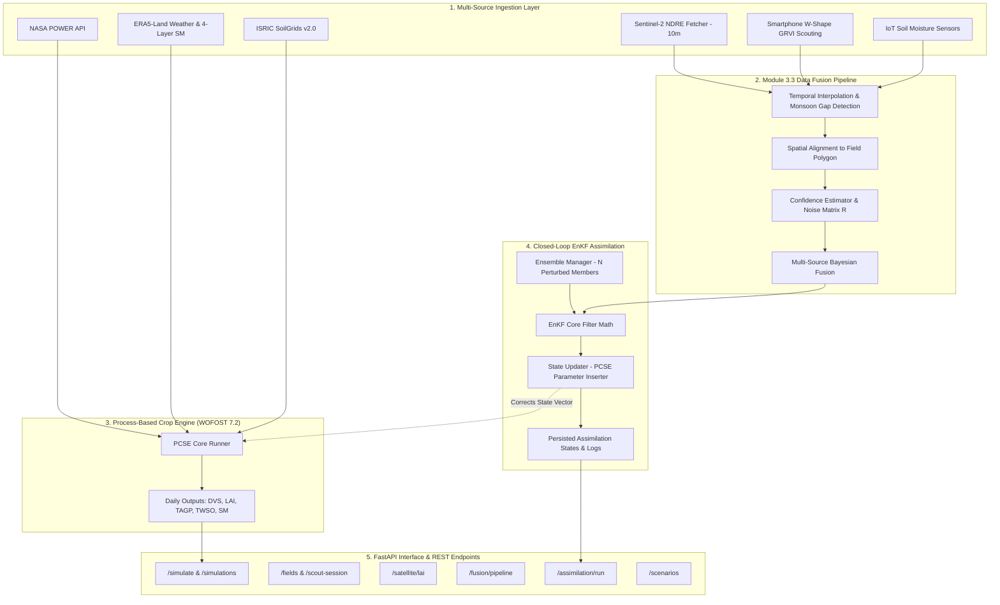
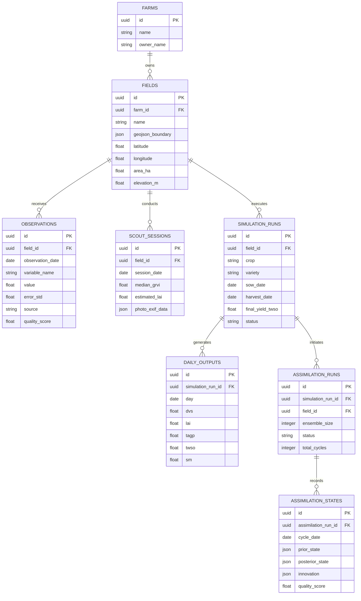

# AgriTwin — Agricultural Digital Twin Platform

> **A physics-based crop simulation digital twin platform that fuses process-based models (WOFOST 7.2 / PCSE) with multi-source remote sensing, geospatial weather/soil data, multi-source data fusion, and sequential data assimilation via the Ensemble Kalman Filter (EnKF).**

---

## 📋 Table of Contents

- [🌟 What Is AgriTwin?](#-what-is-agritwin)
- [📐 Logical System Architecture & Data Flow](#-logical-system-architecture--data-flow)
- [✨ Core Capabilities & Technical Modules](#-core-capabilities--technical-modules)
  - [1. WOFOST Physical Crop Simulation Engine (`simulation/`)](#1-wofost-physical-crop-simulation-engine-simulation)
  - [2. Geospatial Weather & Soil Adapters (`data_sources/`, `services/`)](#2-geospatial-weather--soil-adapters-data_sources-services)
  - [3. Remote Sensing & Observation Layer (`satellite/`, `scout_sessions`)](#3-remote-sensing--observation-layer-satellite-scout_sessions)
  - [4. Module 3.3 Multi-Source Data Fusion Pipeline (`fusion/`, `services/`)](#4-module-33-multi-source-data-fusion-pipeline-fusion-services)
  - [5. Ensemble Kalman Filter (EnKF) Sequential Assimilation (`assimilation/`)](#5-ensemble-kalman-filter-enkf-sequential-assimilation-assimilation)
  - [6. Deterministic Scenario Sweeper Engine (`scenario/`)](#6-deterministic-scenario-sweeper-engine-scenario)
- [🗄️ Database Schema & Data Relationships](#️-database-schema--data-relationships)
- [📂 Comprehensive Directory & Codebase Structure](#-comprehensive-directory--codebase-structure)
- [📡 Complete REST API Endpoint Specification](#-complete-rest-api-endpoint-specification)
- [⚙️ Environment Setup & Execution Guide](#️-environment-setup--execution-guide)
- [🎓 EnKF Assimilation Demonstration (`run_demo.py`)](#-enkf-assimilation-demonstration-run_demo)
- [⚠️ Key System Invariants & LLM Guidelines](#️-key-system-invariants--llm-guidelines)

---

## 🌟 What Is AgriTwin?

AgriTwin is an advanced research and production-grade software platform engineered to maintain a **real-time, closed-loop Digital Twin of crop fields**. Standard crop models suffer from model drift caused by unpredictable localized weather, inaccurate initial soil conditions, or unmodeled field stress. AgriTwin solves this by continuously ingesting incoming satellite, ground-scout, and soil moisture observations, performing **multi-source Bayesian data fusion**, and using an **Ensemble Kalman Filter (EnKF)** to update internal crop and soil state variables without interrupting physical mass balances.

### Key Workflows

1. **Process-Based Simulation**: Executes Wageningen PCSE/WOFOST 7.2 (Water-Limited Growth) to model daily leaf area index (LAI), root depth, soil water balance, dry matter allocation, and final grain yield (`TWSO`).
2. **Global Geospatial Grounding**: Automatically retrieves daily weather (NASA POWER API & ERA5-Land hybrid) and soil hydraulics (ISRIC SoilGrids v2.0 with pedotransfer mapping) for any coordinate on Earth.
3. **Multi-Source Observation Ingestion**:
   - **Sentinel-2 NDRE Satellite Imagery**: 10m resolution Red-Edge Leaf Area Index (LAI) estimates with cloud-adaptive confidence scoring.
   - **W-Shape Smartphone GRVI Protocol**: 5-photo mobile sampling pattern for field scouting, converting RGB photos into LAI with a 30% observation error ("Gentle Nudge" for EnKF).
   - **ERA5-Land Reanalysis**: 4-layer soil moisture (0–7cm, 7–28cm, 28–100cm, 100–289cm) and hourly meteorological parameters.
4. **Module 3.3 Multi-Source Data Fusion**:
   - Temporal gap-filling with monsoon cloud-gap detection (>10-day gap triggers `HOLD_OPEN_LOOP`).
   - Spatial grid alignment across heterogeneous resolutions (10m, 11km, point measurements).
   - Dynamic observation confidence scoring and observation error matrix calculation ($R$).
   - Bayesian weighted multi-source fusion.
5. **Ensemble Kalman Filter (EnKF) Assimilation**: Maintains $N$ stochastic ensemble models (perturbing crop parameters, weather, and soil hydraulics) and executes mathematical state updates on observations to align simulation predictions with physical reality.
6. **Deterministic Scenario Optimization**: Evaluates agricultural strategies (sowing dates, crop varieties, irrigation timing) based on yield (`TWSO`) and Water Use Efficiency (`WUE`).

---

## 📐 Logical System Architecture & Data Flow



---

## ✨ Core Capabilities & Technical Modules

### 1. WOFOST Physical Crop Simulation Engine (`simulation/`)
- **Engine**: Integrates Wageningen PCSE (Python Crop Simulation Environment) `Wofost72_WLP_FD` (Water-Limited Production, Finite Difference soil water model).
- **Daily Timestep**: Simulates daily crop development (`DVS`), Leaf Area Index (`LAI`), Total Aboveground Biomass (`TAGP`), Storage Organ Weight (`TWSO`), Soil Moisture (`SM`), and Transpiration Ratio (`RFTRA`).
- **Agromanagement Parsing**: Dynamic calendar configuration for sowing dates, crop emergence, harvesting, and timed irrigation events.
- **Rice Transplanting Adjustment**: Automatically sets `crop_start_type="emergence"` if the transplanting development stage (`DVSI`) is greater than 0.
- **14-Day Pre-Season Buffer Invariant**: Every simulation automatically starts weather initialization 14 days before the sowing date to accurately initialize soil moisture profiles.

### 2. Geospatial Weather & Soil Adapters (`data_sources/`, `services/`)
- **NASA POWER Source (`data_sources/nasa_power_source.py`)**: Fetches daily solar radiation, Tmin, Tmax, rainfall, wind speed, and vapor pressure for any GPS coordinate. Implements transparent JSON caching in `.agritwin_cache/`.
- **SoilGrids Source (`data_sources/soilgrids_source.py`)**: Downloads clay, sand, and silt fractions across depth layers from ISRIC SoilGrids v2.0.
- **Pedotransfer Soil Hydraulics (`services/soil_service.py`)**: Maps SoilGrids texture classes to WOFOST hydraulic parameters:
  - Saturation capacity (`SM0`)
  - Field capacity (`SMFCF`)
  - Wilting point (`SMW`)
  - Saturated hydraulic conductivity (`K0`)
  - Critical air content (`CRAIRC`)
- **ERA5-Land Integration (`data_sources/era5_land_*.py`, `docs/era5_land_integration.md`)**:
  - 4-layer soil moisture (0–7cm, 7–28cm, 28–100cm, 100–289cm).
  - Hybrid weather router: Uses ERA5-Land for historical data (>60 days old) and NASA POWER for recent operational data (<60 days old).
  - Hourly resolution for high-heat stress modeling and 75-year historical depth (1950+).

### 3. Remote Sensing & Observation Layer (`satellite/`, `scout_sessions`)
- **Sentinel-2 NDRE Fetcher (`satellite/`, `docs/satellite_ndre_fetcher.md`)**:
  - Automated 10m resolution LAI observations every 5 days using Sentinel-2 Red-Edge bands.
  - Converts NDRE to LAI via crop-specific Beer-Lambert extinction formulas.
  - Cloud-adaptive confidence scoring based on SCL (Scene Classification Layer) flags (0.85 clear → 0.0 cloud masked).
- **Smartphone W-Shape GRVI Protocol (`scout_sessions.py`, `docs/w_shape_grvi_protocol.md`)**:
  - 5-photo field sampling pattern walk (W-shape layout).
  - Extracts GPS EXIF metadata to ensure photos are within field boundaries.
  - Calculates median RGB Green-Red Vegetation Index ($\text{GRVI} = \frac{G - R}{G + R}$) and converts to LAI.
  - Assigns a 30% observation error variance ($R = 0.30$), serving as a "Gentle Nudge" for the EnKF filter.
- **Observation Registry Service (`services/observation_registry_service.py`)**:
  - Thin unified ingestion facade providing a standardized registration path for Sentinel, weather, IoT, weather-station, smartphone, and manual scouting observations.
  - Normalizes timestamps (UTC), source enums, units, default uncertainties, and provider names.
  - Integrates with `QualityControlService` for automated lifecycle status evaluation (`VALID`, `OUTLIER`, `REJECTED`).
  - Exposes `POST /observations/register`.

### 4. Module 3.3 Multi-Source Data Fusion Pipeline (`fusion/`, `services/`)
- **Temporal Gap Filling (`services/temporal_interpolation_service.py`)**:
  - Offers linear, cubic spline, and Savitzky-Golay filter interpolation.
  - **Monsoon Cloud-Gap Detection**: Detects gaps exceeding 10 consecutive days. During monsoon cloud cover, returns `HOLD_OPEN_LOOP` signal to instruct the EnKF to hold open-loop rather than assimilating distorted interpolated values.
- **Spatial Alignment Service (`services/spatial_alignment_service.py`)**: Aligns point observations, 10m Sentinel rasters, and 11km ERA5-Land grids to exact GeoJSON field boundary polygons.
- **Centralized Quality Control Service (`services/quality_control_service.py`)**: Consolidates observation QC logic across assimilation, satellite ingestion, and fusion pipelines. Evaluates explicit `ObservationStatus` (`VALID`, `OUTLIER`, `MISSING`, `REJECTED`) against physical variable bounds, satellite cloud thresholds, quality score cutoffs, and statistical Z-score outlier gates relative to forecast ensembles.
- **Confidence Estimator (`services/confidence_estimator.py`)**: Dynamically computes observation confidence scores ($0.0 - 1.0$) and computes the observation error covariance matrix ($R$) for EnKF ingestion.
- **Multi-Source Bayesian Fusion (`services/multi_source_fusion_service.py`)**: Performs Bayesian optimal weighting to combine Sentinel-2, smartphone GRVI, ERA5-Land, and IoT ground sensors into a unified, high-confidence state observation stream.
- **End-to-End Fusion Pipeline (`services/data_fusion_pipeline.py`)**: Executes full chain: Quality Control $\rightarrow$ Temporal $\rightarrow$ Spatial $\rightarrow$ Confidence $\rightarrow$ Fusion via `POST /fusion/pipeline`.

### 5. Ensemble Kalman Filter (EnKF) Sequential Assimilation (`assimilation/`)
- **Stochastic Ensemble Generation (`assimilation/ensemble/ensemble_manager.py`)**:
  - Manages $N$ parallel WOFOST engines (default $N=25$).
  - Perturbs crop parameters (`SLATB`, `SPAN`, `TSUM1`, `TSUM2`) with Gaussian noise (up to 10% standard deviation).
  - Enforces physical soil moisture bounds: $\text{SMW} < \text{SMFCF} < \text{SM0}$.
  - Uses `PerturbedWeatherProvider` to add daily stochastic perturbations to solar radiation, temperature, and precipitation.
- **Physical State Vector (`assimilation/state/state_vector.py`)**:
  - Maps physical variables: Leaf Area Index (`LAI`), Soil Moisture (`SM`), Leaf Weight (`WLV`), Stem Weight (`WST`), Root Weight (`WRT`), and Storage Organ Weight (`WSO`).
  - Implements matrix-to-dictionary and dictionary-to-matrix transformations.
- **EnKF Filter Mathematics (`assimilation/filters/enkf.py`)**:
  - Forecast ensemble matrix: $A^f \in \mathbb{R}^{n \times N}$
  - Forecast covariance matrix: $P^f = \frac{1}{N-1} (A^f - \bar{A}^f)(A^f - \bar{A}^f)^T$
  - Kalman Gain computation: $K = P^f H^T (H P^f H^T + R)^{-1}$
  - Posterior state update: $A^a = A^f + K (D - H A^f)$
- **Non-Destructive State Updater (`assimilation/updater/state_updater.py`)**:
  - Re-partitions leaf biomass across green leaf age classes (`LV`) to match EnKF posterior `WLV` without triggering mass balance crashes.
  - Updates soil water availability and root zone distribution.
- **Quality Control, Dynamic Data Fusion & Persistence (`assimilation/services/assimilation_service.py`)**:
  - Delegates pre-assimilation filtering to `QualityControlService` for physical bounds, quality scores, satellite cloud cover, and forecast Z-score outlier gating.
  - Dynamically routes valid observations through `ConfidenceEstimator` and `MultiSourceFusionService` to generate dynamic observation error covariance ($R$) matrices and inverse-variance fused observation vectors ($y$).
  - Logs step-by-step priors, posteriors, innovations, dynamic $R$ variances, and fusion diagnostics metadata into `AssimilationState`.
- **Canonical State Estimation & Deprecation of Secondary Mutation**:
  - The canonical state-estimation path is strictly enforced as: `observations → QC → fusion → EnKF → assimilated WOFOST`.
  - Direct database mutation of `DailyOutput` records in `ErrorCorrectionService` is deprecated and removed. `POST /error-correction/correct-window` now delegates observation validation to `QualityControlService` and returns diagnostic residual metrics without modifying `DailyOutput`.
- **Diagnostics & Visualization (`assimilation/services/assimilation_visualization_service.py`)**:
  - *History*: Complete audit trail of cycle updates.
  - *Timeseries*: Zero-Order Hold (ZOH) offset propagated prediction curves comparing open-loop vs EnKF.
  - *Yield Evolution*: Sequential yield convergence (`TWSO`) tracking across assimilation dates.

### 7. Leakage-Safe Feature Engine (`features/`)
- **Leakage-Safe Feature Engine (`features/feature_engine.py`)**:
  - Extracts tabular feature vectors (`FeatureVector`) at forecast/assimilation timestamps (`as_of_date`).
  - Computes canopy and biomass growth rates: $\Delta \text{LAI} / \Delta t$ and $\Delta \text{TAGP} / \Delta t$ over 1-day and 7-day windows.
  - Computes cumulative water-stress indicators: accumulated transpiration deficit $\sum (1 - \text{RFTRA})$, recent window averages, and soil moisture deficit.
  - Computes thermal-stress indicators: heat stress days ($T_{\max} > 35^\circ\text{C}$), cold stress days ($T_{\min} < 5^\circ\text{C}$), and diurnal temperature range metrics.
  - Computes EnKF innovation statistics (mean innovation, latest innovation per variable) and ensemble prior/posterior spread.
  - Computes observation quality indicators (valid/rejected counts, mean quality score, sources present) and observation age relative to `as_of_date`.
### 8. Ensemble Forward Trajectory Forecast Service (`services/forecast_service.py`)
- **Forward Trajectory Forecast Engine (`ForecastService`)**:
  - Reuses existing WOFOST `EnsembleManager` infrastructure to generate forward trajectories from the latest EnKF assimilation state through `harvest_date`.
  - Computes daily mean trajectories, ensemble standard deviations ($\sigma$), and 95% prediction intervals ($P_{2.5}$ to $P_{97.5}$) for state variables (`LAI`, `SM`, `TAGP`, `TWSO`, `DVS`, `RFTRA`).
  - Computes harvest yield forecast (`TWSO` at harvest date) with mean, standard deviation, 95% prediction interval, and min/max bounds.
  - Computes statistical uncertainty metrics (yield Coefficient of Variation $\text{CV} = \sigma / \mu$, 95% prediction interval width, and relative uncertainty percentage).
### 9. Residual Yield Model Abstraction (`residual/`)
- **Residual Model Abstraction (`residual/base.py`, `no_residual.py`, `registry.py`)**:
  - Defines target residual $\text{residual\_target} = \text{observed\_yield} - \text{assimilated\_WOFOST\_yield}$.
  - Provides the abstract `ResidualModel` interface enforcing methods for availability checks (`is_available()`), applicability checks (`is_applicable()`), residual prediction (`predict_residual()`), uncertainty estimation (`predict_uncertainty()`), and yield correction application (`apply_correction()`).
  - Includes `NoResidualModel` default identity fallback: when no validated ML model artifact exists, `is_available()` returns `False` and returns the assimilated WOFOST prediction unchanged with zero residual correction.
  - Includes `ResidualModelRegistry` for managing and resolving crop/region-specific residual models.
### 10. Crop Model Configuration Registry (`crops/`)
- **Crop Configuration & Registry (`crops/registry.py`, `defaults.py`, `schemas.py`)**:
  - Centralized `CropRegistry` and `CropConfig` schema capturing crop-specific parameters without modifying or rewriting the underlying WOFOST 7.2 simulation engine.
  - Encapsulates WOFOST parameter defaults (default variety, YAML filename, $TSUM1$, $TSUM2$, $SPAN$, $SLATB$), phenology rules (`crop_start_type`, `crop_end_type`, DVS landmarks), sensor-to-WOFOST observation mappings, calibration metadata, and residual-model linkages.
  - Auto-discovery mechanism for secondary crops available in WOFOST parameter files (`sunflower`, `cassava`, `cotton`, `barley`, `potato`, `soybean`, etc.).
  - Preserves 100% numerical identity with legacy WOFOST execution pathways.

---

## 🗄️ Database Schema & Data Relationships



---

## 📂 Comprehensive Directory & Codebase Structure

```text
AgriTwin/
├── .agritwin_cache/                     # Local JSON cache for NASA POWER & SoilGrids responses
├── alembic/                             # Database migration scripts & schemas
│   ├── env.py                           # Migration environment configuration
│   └── versions/                        # Sequential database schema migration files
├── backend/
│   └── app/
│       ├── main.py                      # FastAPI app entrypoint & router mounts
│       ├── api/                         # Primary API routes & Pydantic schemas
│       │   ├── routes/
│       │   │   ├── simulate.py          # POST /simulate (open-loop WOFOST runner)
│       │   │   ├── simulations.py       # GET/DELETE /simulations history
│       │   │   ├── fields.py            # CRUD /fields management
│       │   │   ├── scout_sessions.py    # POST /fields/{id}/scout-session (W-shape GRVI)
│       │   │   ├── fusion.py            # Data fusion endpoints (Module 3.3)
│       │   │   ├── interpolation.py     # Temporal interpolation routes
│       │   │   └── error_correction.py  # Error correction utilities
│       │   └── schemas/                 # Request & Response Pydantic models
│       ├── assimilation/                # Ensemble Kalman Filter Subsystem
│       │   ├── api/                     # Assimilation & Observation routes
│       │   ├── ensemble/                # Ensemble member & manager perturbators
│       │   ├── filters/                 # EnKF mathematical update core (enkf.py)
│       │   ├── forecast/                # Step-by-step forecast loop orchestrator
│       │   ├── models/                  # Assimilation ORM models (AssimilationState)
│       │   ├── repositories/            # DB persistence handlers for EnKF cycles
│       │   ├── schemas/                 # EnKF request/response models & visualization contracts
│       │   ├── services/                # Sequential assimilation & ZOH visualizer
│       │   ├── state/                   # EnKF StateVector layout & matrix converters
│       │   └── updater/                 # Non-destructive PCSE state variable updater
│       ├── core/                        # System configurations & custom exceptions
│       ├── data_sources/                # Geospatial weather & soil data adapters
│       │   ├── nasa_power_source.py     # NASA POWER weather API client
│       │   ├── soilgrids_source.py      # ISRIC SoilGrids REST client
│       │   ├── era5_land_source.py      # ERA5-Land reanalysis client
│       │   ├── era5_land_weather_source.py # ERA5-Land weather adapter
│       │   ├── sensor_source.py         # IoT soil moisture telemetry adapter
│       │   └── satellite_source.py      # Satellite scene ingestion interface
│       ├── db/                          # Database connection session & SQLAlchemy base
│       ├── models/                      # SQLAlchemy ORM Models (Farm, Field, SimulationRun, DailyOutput)
│       ├── repositories/                # DB repositories for core entities
│       ├── satellite/                   # Remote Sensing LAI Processing Pipeline
│       │   ├── api/                     # GET /satellite/lai route
│       │   ├── processors/              # NDVI, EVI, NDRE & LAI estimator functions
│       │   ├── providers/               # Sentinel-2 provider & SCL cloud masking
│       │   ├── schemas/                 # Satellite scene schemas
│       │   └── services/                # LAI observation calculation service
│       ├── features/                    # Leakage-Safe Feature Engine
│       │   ├── feature_engine.py        # Tabular feature extraction engine (ΔLAI/Δt, ΔTAGP/Δt, stress, innovation, obs quality)
│       │   └── schemas.py               # FeatureVector & category Pydantic schemas
│       ├── crops/                       # Crop Model Configuration & Registry
│       │   ├── defaults.py              # Default CropConfig definitions (wheat, rice, maize, etc.)
│       │   ├── registry.py              # CropRegistry manager & auto-discovery engine
│       │   └── schemas.py               # CropConfig, Phenology, Observation & Calibration schemas
│       ├── residual/                    # Residual Yield Model Abstraction
│       │   ├── base.py                  # ResidualModel ABC interface
│       │   ├── no_residual.py           # NoResidualModel default identity fallback
│       │   ├── registry.py              # ResidualModelRegistry manager
│       │   └── schemas.py               # ModelMetadata & prediction schemas
│       ├── scenario/                    # Deterministic Scenario Sweeper Subsystem
│       │   ├── api/                     # POST /scenarios endpoints
│       │   ├── generators/              # Sowing date, variety, & irrigation generators
│       │   ├── models/                  # Scenario run & comparison ORM models
│       │   ├── runners/                 # Scenario sweep execution runner
│       │   ├── schemas/                 # Scenario request schemas
│       │   └── services/                # Sowing date shift & WUE comparison engine
│       ├── services/                    # Core business logic services
│       │   ├── simulation_service.py    # WOFOST execution coordinator
│       │   ├── weather_service.py       # Hybrid weather service router
│       │   ├── soil_service.py          # Pedotransfer soil parameter calculator
│       │   ├── temporal_interpolation_service.py # Monsoon gap-filling interpolator
│       │   ├── spatial_alignment_service.py # Geospatial polygon grid aligner
│       │   ├── confidence_estimator.py   # Observation error matrix R generator
│       │   ├── multi_source_fusion_service.py # Bayesian multi-source fusion engine
│       │   ├── data_fusion_pipeline.py  # End-to-end Module 3.3 fusion pipeline
│       │   ├── forecast_service.py      # Ensemble forward trajectory forecast service
│       │   └── error_correction_service.py # Diagnostic residual service (Deprecated direct DB mutation)
│       ├── simulation/                  # PCSE WOFOST Engine Adapters
│       │   ├── engine.py                # WOFOST 7.2 execution runner
│       │   ├── agromanagement.py        # Agromanagement parser & rice DVSI fix
│       │   ├── crop_provider.py         # Crop parameter file reader
│       │   ├── soil_provider.py         # PCSE soil parameter struct builder
│       │   ├── site_provider.py         # PCSE site parameter builder
│       │   ├── weather_provider.py      # PCSE weather provider builder
│       │   └── output_parser.py         # Raw PCSE dict parser
│       └── twin/                        # Digital Twin high-level field state representation
├── docs/                                # Technical specifications & architectural documentation
│   ├── era5_land_integration.md         # ERA5-Land hybrid weather & soil moisture doc
│   ├── satellite_ndre_fetcher.md        # Sentinel-2 NDRE LAI pipeline doc
│   ├── w_shape_grvi_protocol.md         # Smartphone 5-photo GRVI protocol doc
│   ├── enkf_design.md                   # Ensemble Kalman Filter design specification
│   ├── state_variables.md               # WOFOST physical state variables reference
│   ├── database_schema.md               # Complete database schema reference
│   └── simulation_pipeline.md           # PCSE simulation pipeline guide
├── external_repos/                      # Parameter repositories (WOFOST crop files)
├── scripts/                             # Verification & data fetch scripts
│   ├── fetch_satellite_data.py          # Standalone satellite fetch script
│   └── verify_satellite_integration.py  # Integration test script for remote sensing
├── tests/                               # Comprehensive unit & integration test suite (290 tests)
├── alembic.ini                          # Alembic configuration
├── pyproject.toml                       # Python project configuration
├── pytest.ini                            # Pytest configuration
├── requirements.txt                     # Production requirements specification
├── run_demo.py                          # Complete end-to-end EnKF demonstration script
└── uv.lock                              # Dependency lock file
```

---

## 📡 Complete REST API Endpoint Specification

### 1. Simulation Endpoints (`/simulate`, `/simulations`)
- `POST /simulate`: Runs a baseline open-loop WOFOST simulation given coordinates, crop, variety, and sowing date. Returns summary metrics and full daily output timeseries.
- `GET /simulate/crops`: Returns supported crops and available varieties.
- `GET /simulations`: Lists historical simulation runs with pagination.
- `GET /simulations/{simulation_id}`: Retrieves detailed simulation outputs and daily variables.
- `DELETE /simulations/{simulation_id}`: Cascade-deletes a simulation run and its associated daily outputs.

### 2. Field Management (`/fields`)
- `POST /fields`: Registers a new agricultural field (name, GeoJSON boundary polygon, centroid, area, elevation).
- `GET /fields`: Lists registered fields.
- `GET /fields/{field_id}`: Retrieves field details and spatial metadata.
- `DELETE /fields/{field_id}`: Cascade-deletes field and all associated observations, simulations, and EnKF runs.

### 3. W-Shape GRVI Scout Protocol (`/fields/{id}/scout-session`)
- `POST /fields/{field_id}/scout-session`: Submits a 5-photo smartphone field scouting session. Calculates median GRVI, converts to LAI, and registers a field observation with $R=0.30$.
- `GET /fields/{field_id}/scout-sessions`: Lists historical scout sessions for a field.
- `GET /fields/{field_id}/scout-sessions/{session_id}`: Retrieves specific scout session details.

### 4. Remote Sensing & Satellite (`/satellite`)
- `GET /satellite/lai`: Queries Sentinel-2 NDRE scenes for a field boundary and date range, applies SCL cloud masking, converts to LAI, and registers observations.

### 5. Observations Ingestion (`/observations`)
- `POST /observations`: Ingests single or batch field observations (LAI, SM, etc.).
- `GET /observations`: Lists observations filtered by `field_id`, variable, date range, or quality score.

### 6. Module 3.3 Data Fusion Pipeline (`/fusion`)
- `POST /fusion/fill-gaps`: Interpolates temporal gaps (linear, cubic spline, savgol) with monsoon cloud-gap detection (>10 days $\rightarrow$ `HOLD_OPEN_LOOP`).
- `POST /fusion/spatial-align`: Aligns multi-resolution point/raster data to field GeoJSON boundary.
- `POST /fusion/confidence`: Computes dynamic confidence scores and observation noise covariance matrix ($R$).
- `POST /fusion/fuse`: Fuses multiple observation streams into a single Bayesian estimate.
- `POST /fusion/pipeline`: Executes end-to-end multi-source data fusion pipeline.

### 7. EnKF Data Assimilation (`/assimilation`)
- `POST /assimilation/run`: Triggers sequential EnKF forecast-assimilation loop for a baseline simulation.
- `GET /assimilation/{run_id}/status`: Returns status (`PENDING`, `RUNNING`, `COMPLETED`, `FAILED`) and diagnostic metrics.
- `GET /assimilation/{simulation_id}/history`: Returns step-by-step audit trail of prior, posterior, innovation, and quality score for each cycle.
- `GET /assimilation/{simulation_id}/timeseries`: Returns daily comparative timeseries (Open-Loop vs EnKF ZOH offset projection vs Observations).
- `GET /assimilation/{simulation_id}/yield-evolution`: Returns predicted yield (`TWSO`) convergence across successive assimilation cycles.

### 8. Deterministic Scenario Optimization (`/scenarios`)
- `POST /scenarios/sowing-date`: Runs sowing date shift sweep (e.g. ±7, ±14, ±21 days).
- `POST /scenarios/variety`: Sweeps across available crop varieties.
- `POST /scenarios/irrigation`: Sweeps across deficit and stage-triggered irrigation schedules.

### 9. System Probe (`/health`)
- `GET /health`: Returns service status and SQLite/PostgreSQL database connectivity check.

---

## ⚙️ Environment Setup & Execution Guide

### 1. Requirements & Prerequisites
- Linux / macOS
- Python 3.10+
- SQLite3 or PostgreSQL

### 2. Virtual Environment Setup
```bash
# Clone repository and navigate to root directory
cd /home/vini/Arena/AgriTwin

# Create and activate virtual environment
python3 -m venv venv
source venv/bin/activate

# Install required dependencies
pip install -r requirements.txt
```

### 3. Database Schema Initialization
```bash
# Execute Alembic migrations to build schema
alembic upgrade head
```

### 4. Running the Development API Server
```bash
python -m uvicorn backend.app.main:app --reload --host 0.0.0.0 --port 8000
```
Interactive API documentation:
- **Swagger UI**: [http://localhost:8000/docs](http://localhost:8000/docs)
- **ReDoc**: [http://localhost:8000/redoc](http://localhost:8000/redoc)

### 5. Running Verification Test Suite
To run all unit and integration tests:
```bash
pytest
```

---

## 🎓 EnKF Assimilation Demonstration (`run_demo.py`)

AgriTwin includes a complete, standalone, automated demonstration script `run_demo.py` that executes an end-to-end assimilation campaign for a Rice IR64 crop in Lucknow, India:

```bash
python3 run_demo.py
```

### What `run_demo.py` Performs:
1. **Field Registration**: Registers a demo farm and field polygon in Lucknow, India ($26.8^\circ\text{N}, 80.9^\circ\text{E}$).
2. **Observation Ingestion**: Ingests 20 synthetic Sentinel-2 satellite LAI observations spanning the season (June to November).
3. **Open-Loop Simulation**: Runs an open-loop WOFOST simulation (Yield output: **7271.7 kg/ha**).
4. **EnKF Assimilation Execution**: Launches a 25-member ensemble closed-loop EnKF forecast-assimilation run.
5. **Audit Trail**: Outputs step-by-step priors, posteriors, innovations, and quality control decisions per cycle.
6. **Convergence Verification**: Displays predicted yield convergence across cycle steps (converging to **5774.36 kg/ha**).
7. **Timeseries Comparison**: Constructs a comparative table contrasting Open-Loop LAI/TWSO vs EnKF Assimilated values.

---

## ⚠️ Key System Invariants & LLM Guidelines

When reading, updating, or maintaining code in AgriTwin, **strictly enforce the following architectural rules**:

1. **The 14-Day Pre-Season Weather Invariant**:
   - PCSE WOFOST requires 14 days of pre-sowing weather data to initialize root zone water balances.
   - All weather providers (`nasa_power_source`, `era5_land_source`, `EnsembleManager`) MUST fetch weather starting from `sow_date - 14 days`.

2. **Database Session Commits in FastAPI Routes**:
   - Call `db.commit()` inside POST route handlers *before* returning JSON responses to prevent SQLite race conditions with async background tasks.

3. **Ensemble Physical Bounding Rules**:
   - Perturbed parameters MUST satisfy physical domain rules: $\text{SMW} < \text{SMFCF} < \text{SM0}$.
   - Ensure a minimum gap of $0.02$ between wilting point, field capacity, and saturation.

4. **Zero-Order Hold (ZOH) Offset Propagation**:
   - The comparative timeseries visualizer computes correction offsets ($\text{posterior} - \text{prior}$) on assimilation dates and holds them constant (ZOH) forward in time to generate seamless daily curves without re-simulating the entire past.

5. **Monsoon Cloud-Gap Handling (`HOLD_OPEN_LOOP`)**:
   - When satellite observations are missing for $>10$ consecutive days, temporal interpolation returns `HOLD_OPEN_LOOP`.
   - The EnKF assimilation engine must skip mathematical state updates and let the ensemble run open-loop until clean observations resume.

---

**Built for agronomists, remote sensing scientists, and AI digital twin developers.** 🌾
