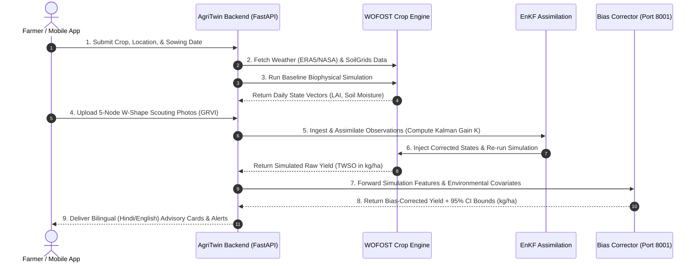

# 🏛️ AgriTwin — System Design Document (SDD)

**Project Title:** Digital Twin Decision-Support System for Smallholder Farmers  
**Document Version:** 1.0  
**Target Audience:** Engineering Leads, Software Architects, Developers, and Technical Stakeholders  

---

## 1. System Overview & Architectural Strategy

**AgriTwin** is a zero-IoT digital twin architecture designed specifically for smallholder farms (2–5 acres) in India. The system fuses crop growth physics modeling (**WOFOST**), remote sensing (**Sentinel-2 / ERA5-Land**), smartphone edge vision (**GRVI W-shape photo scouting**), and machine learning bias correction (**Stacked Ensemble + Gaussian Processes**) into a unified assimilation pipeline.

```
┌─────────────────────────────────────────────────────────────────────────────┐
│                         FARMER'S SMARTPHONE                                 │
│  (App / WhatsApp / Telegram / SMS)                                          │
│   - Crop, Location, & Sowing Date Input                                     │
│   - 5-Node W-Shape RGB Scouting Photos (GRVI)                               │
│   - Receives Bilingual (Hindi/English) Advisories & Yield Predictions       │
└──────────────────────────────┬──────────────────────────────────────────────┘
                               │ HTTP / MQTT / SMS Gateway
                               ▼
┌─────────────────────────────────────────────────────────────────────────────┐
│                          AGRITWIN BACKEND ARCHITECTURE                      │
│                       (FastAPI + PostgreSQL/PostGIS + Redis)                │
│                                                                             │
│  ┌───────────────────────────────────────────────────────────────────────┐  │
│  │                     LAYER 1: DATA INGESTION ENGINE                    │  │
│  │  ┌────────────┐  ┌────────────┐  ┌────────────┐  ┌────────────┐       │  │
│  │  │ ERA5-Land  │  │ Sentinel-2 │  │  GRVI      │  │ SoilGrids  │       │  │
│  │  │ (Weather)  │  │  (NDRE)    │  │  Scouting  │  │  (Soil)    │       │  │
│  │  └────────────┘  └────────────┘  └────────────┘  └────────────┘       │  │
│  └───────────────────────────────────┬───────────────────────────────────┘  │
│                                      │                                      │
│                                      ▼                                      │
│  ┌───────────────────────────────────────────────────────────────────────┐  │
│  │                     LAYER 2: CROP SIMULATION ENGINE                   │  │
│  │  ┌─────────────────────────────────────────────────────────────────┐  │  │
│  │  │            ENHANCED WOFOST CROP ENGINE (Physics)                │  │  │
│  │  │  - Phenology & Canopy Growth (LAI)                              │  │  │
│  │  │  - 4-Layer Soil Hydrology (ERA5-driven)                         │  │  │
│  │  │  - Thermal Stress & Nitrogen Dynamics                           │  │  │
│  │  └─────────────────────────────────────────────────────────────────┘  │  │
│  └───────────────────────────────────┬───────────────────────────────────┘  │
│                                      │                                      │
│                                      ▼                                      │
│  ┌───────────────────────────────────────────────────────────────────────┐  │
│  │                    LAYER 3: DATA ASSIMILATION ENGINE                  │  │
│  │  ┌─────────────────────────────────────────────────────────────────┐  │  │
│  │  │            ENSEMBLE KALMAN FILTER (EnKF - 25 Members)           │  │  │
│  │  │  - State Assimilation: Leaf Area Index (LAI) & Soil Moisture    │  │  │
│  │  │  - Observational Covariance Tuning for Sparse GRVI Inputs      │  │  │
│  │  └─────────────────────────────────────────────────────────────────┘  │  │
│  └───────────────────────────────────┬───────────────────────────────────┘  │
│                                      │                                      │
│                                      ▼                                      │
│  ┌───────────────────────────────────────────────────────────────────────┐  │
│  │                LAYER 4: BIAS CORRECTION & ML ENGINE                   │  │
│  │  ┌─────────────────────────────────────────────────────────────────┐  │  │
│  │  │           BIAS CORRECTOR MICROSERVICE (Port 8001)                │  │  │
│  │  │  - Stacked Ensemble (XGBoost + RandomForest + LightGBM)          │  │  │
│  │  │  - Gaussian Process Spatial-Temporal Correction                 │  │  │
│  │  │  - Population Stability Index (PSI) Drift Monitoring           │  │  │
│  │  └─────────────────────────────────────────────────────────────────┘  │  │
│  └───────────────────────────────────┬───────────────────────────────────┘  │
│                                      │                                      │
│                                      ▼                                      │
│  ┌───────────────────────────────────────────────────────────────────────┐  │
│  │                     LAYER 5: OUTPUT & ADVISORY GENERATOR              │  │
│  │  ┌─────────────────────────────────────────────────────────────────┐  │  │
│  │  │  - Final Yield Estimation (kg/ha) & Confidence Intervals        │  │  │
│  │  │  - Hindi/English Decision Support Cards (N-Stress, Irrigation)   │  │  │
│  │  │  - MSP Profit Ranking & Historical Yield Comparisons            │  │  │
│  │  └─────────────────────────────────────────────────────────────────┘  │  │
│  └───────────────────────────────────────────────────────────────────────┘  │
└─────────────────────────────────────────────────────────────────────────────┘
```

---

## 2. End-to-End Sequence & Execution Flow



---

## 3. Data Schema & Entity Relationships

The relational persistence layer is built on **PostgreSQL + PostGIS** to store geospatial boundaries, environmental time-series, simulation states, and observations.

```sql
-- 1. Farm & Spatial Boundary Table
CREATE TABLE farms (
    farm_id UUID PRIMARY KEY DEFAULT gen_random_uuid(),
    farmer_name VARCHAR(100) NOT NULL,
    state VARCHAR(50) NOT NULL,
    district VARCHAR(50) NOT NULL,
    geom GEOMETRY(Point, 4326) NOT NULL,
    created_at TIMESTAMP WITH TIME ZONE DEFAULT CURRENT_TIMESTAMP
);

-- 2. Field Seasons Table
CREATE TABLE field_seasons (
    season_id UUID PRIMARY KEY DEFAULT gen_random_uuid(),
    farm_id UUID REFERENCES farms(farm_id) ON DELETE CASCADE,
    crop_type VARCHAR(50) NOT NULL,
    sowing_date DATE NOT NULL,
    expected_harvest_date DATE,
    status VARCHAR(20) DEFAULT 'ACTIVE'
);

-- 3. Daily Environmental Ingestion Log Table
CREATE TABLE daily_environmental_data (
    log_id BIGSERIAL PRIMARY KEY,
    season_id UUID REFERENCES field_seasons(season_id) ON DELETE CASCADE,
    date DATE NOT NULL,
    temp_max_c NUMERIC(4,2),
    temp_min_c NUMERIC(4,2),
    precipitation_mm NUMERIC(5,2),
    solar_radiation_mj_m2 NUMERIC(5,2),
    soil_moisture_layer1 NUMERIC(4,3),
    soil_moisture_layer2 NUMERIC(4,3),
    soil_moisture_layer3 NUMERIC(4,3),
    soil_moisture_layer4 NUMERIC(4,3)
);

-- 4. Scouting & Remote Sensing Observations Table
CREATE TABLE observations (
    obs_id UUID PRIMARY KEY DEFAULT gen_random_uuid(),
    season_id UUID REFERENCES field_seasons(season_id) ON DELETE CASCADE,
    obs_date DATE NOT NULL,
    source_type VARCHAR(20) CHECK (source_type IN ('GRVI_SCOUTING', 'SENTINEL_2_NDRE', 'SENTINEL_1_SAR')),
    lai_value NUMERIC(4,2),
    grvi_score NUMERIC(4,3),
    n_stress_index NUMERIC(3,2),
    confidence_score NUMERIC(3,2),
    image_paths TEXT[]
);

-- 5. Yield & Advisory Prediction Logs Table
CREATE TABLE yield_predictions (
    prediction_id UUID PRIMARY KEY DEFAULT gen_random_uuid(),
    season_id UUID REFERENCES field_seasons(season_id) ON DELETE CASCADE,
    run_timestamp TIMESTAMP WITH TIME ZONE DEFAULT CURRENT_TIMESTAMP,
    wofost_raw_yield_kg_ha NUMERIC(7,2),
    corrected_yield_kg_ha NUMERIC(7,2),
    confidence_lower_bound NUMERIC(7,2),
    confidence_upper_bound NUMERIC(7,2),
    advisory_summary_hi TEXT,
    advisory_summary_en TEXT
);
```

---

## 4. Submodule Technical Specifications

### 4.1 Data Ingestion Microservice
- **ERA5-Land Pipeline**: Downloads daily $2\text{m}$ temperature ($T_{\min}, T_{\max}, T_{\text{mean}}$), surface solar radiation ($SSRD$), total precipitation ($TP$), dewpoint ($D2M$), wind components ($U10, V10$), and 4-layer volumetric soil water ($0\text{--}7\text{cm}$, $7\text{--}28\text{cm}$, $28\text{--}100\text{cm}$, $100\text{--}289\text{cm}$).
- **SoilGrids Pipeline**: Queries $250\text{m}$ resolution global soil grids for sand, clay, silt percentages, and bulk density, converting them into WOFOST hydraulic coefficients ($SMW$, $SMFCF$, $SM0$, $K_0$).
- **RGB GRVI Processor**: Computes Green-Red Vegetation Index from smartphone 5-node W-shape ground scouting:
  $$\text{GRVI} = \frac{\text{Green} - \text{Red}}{\text{Green} + \text{Red}}$$

### 4.2 WOFOST Biophysical Crop Engine
- Integrates daily gross $CO_2$ assimilation based on intercepted photosynthetically active radiation (PAR).
- Driven by phenological stage progression ($DVS$) from emergence ($DVS=0.0$) through anthesis/flowering ($DVS=1.0$) to physiological maturity ($DVS=2.0$).
- Daily carbon partitioning into leaves ($TWLV$), stems ($TWST$), roots ($TWRT$), and storage organs ($TWSO$).

### 4.3 Data Assimilation (EnKF)
- Maintains $N=25\text{--}50$ stochastic ensemble members perturbed by Gaussian noise on daily weather parameters and initial soil moisture.
- **State Vector ($\mathbf{x}_t$)**:
  $$\mathbf{x}_t = [\text{LAI}_t, \text{SM}_t^{(1)}, \text{SM}_t^{(2)}, \text{SM}_t^{(3)}, \text{SM}_t^{(4)}]^T$$
- Updates WOFOST state arrays whenever satellite NDRE or ground GRVI observations arrive using optimal Kalman Gain $\mathbf{K}$:
  $$\mathbf{K} = \mathbf{P}^f \mathbf{H}^T (\mathbf{H} \mathbf{P}^f \mathbf{H}^T + \mathbf{R})^{-1}$$
  $$\mathbf{x}_i^a = \mathbf{x}_i^f + \mathbf{K} (\mathbf{y}_i - \mathbf{H}\mathbf{x}_i^f)$$

### 4.4 Bias Corrector Service (Port 8001)
- **Stacking Architecture**:
  - *Base Estimators*: XGBoost Regressor, Random Forest Regressor, LightGBM Regressor.
  - *Meta-Estimator*: Ridge Regression with non-negative weighting constraints.
- **Spatial-Temporal Smoothing**: Gaussian Process Regression (GPR) with spatiotemporal covariance kernel:
  $$k((x, y, t), (x', y', t')) = k_{\text{spatial}}(x, y; x', y') \times k_{\text{temporal}}(t, t')$$
- **Drift Monitoring**: Computes Population Stability Index (PSI) to detect environmental covariate shifts or climate anomalies.

---

## 5. Technology Stack & Component Mapping

| Category | Component | Selected Technology | Operational Role |
|---|---|---|---|
| **API Framework** | Backend API | **FastAPI** (Python 3.11/3.12, Async) | Core business logic, data routing, advisory delivery |
| **Database** | RDBMS / Spatial GIS | **PostgreSQL 15 + PostGIS** | Farm spatial polygons, time-series, observations |
| **Caching / Tasks** | Task Broker & Cache | **Redis 7 + Celery Workers** | Asynchronous job execution and observation queues |
| **Physics Engine** | Crop Growth Simulator | **PCSE / WOFOST 7.2** | Mechanistic biophysical crop & water modeling |
| **Machine Learning** | Model Framework | **Scikit-Learn, XGBoost, LightGBM, GPyTorch** | Stacked residual learning, spatiotemporal GP |
| **Containerization** | Infrastructure | **Docker + Docker Compose** | Microservice orchestration and deployment |

---

## 6. Deployment Architecture (`docker-compose.yml`)

```yaml
version: '3.8'

services:
  agritwin-db:
    image: postgis/postgis:15-3.3
    container_name: agritwin_postgis
    restart: unless-stopped
    environment:
      POSTGRES_DB: agritwin
      POSTGRES_USER: postgres
      POSTGRES_PASSWORD: ${DB_PASSWORD:-postgres}
    ports:
      - "5432:5432"
    volumes:
      - pgdata:/var/lib/postgresql/data

  agritwin-redis:
    image: redis:7-alpine
    container_name: agritwin_redis
    restart: unless-stopped
    ports:
      - "6379:6379"

  agritwin-backend:
    build:
      context: .
      dockerfile: backend/Dockerfile
    container_name: agritwin_api
    restart: unless-stopped
    command: uvicorn backend.app.main:app --host 0.0.0.0 --port 8000
    ports:
      - "8000:8000"
    environment:
      DATABASE_URL: postgresql://postgres:${DB_PASSWORD:-postgres}@agritwin-db:5432/agritwin
      REDIS_URL: redis://agritwin-redis:6379/0
      BIAS_CORRECTOR_URL: http://bias-corrector:8001
    depends_on:
      - agritwin-db
      - agritwin-redis

  bias-corrector:
    build:
      context: ./bias-corrector
      dockerfile: Dockerfile
    container_name: agritwin_bias_corrector
    restart: unless-stopped
    command: uvicorn main:app --host 0.0.0.0 --port 8001
    ports:
      - "8001:8001"

volumes:
  pgdata:
```

---

## 7. Traceability Matrix: Core Requirements vs. System Components

| # | Core Farmer Requirement | System Submodule / Component | Output Delivered to User |
|---|---|---|---|
| **1** | **Crop Selection & Profit Optimization** | `CropAdvisor Engine` + `Mandi Price / MSP Service` | Ranked list of seasonal crops with projected net profit per acre (₹/acre). |
| **2** | **Yield Prediction & Confidence** | `WOFOST` + `EnKF` + `Bias Corrector (Port 8001)` | Accurate harvest yield prediction in kg/ha with $\pm$ 95% confidence intervals. |
| **3** | **Stress Detection & Correction** | `GRVI Processor` + `EnKF State Update` + `Advisory Engine` | Actionable Hindi/English advisory cards with Urea top-dressing dosage. |
| **4** | **Irrigation & Sowing Guidance** | `4-Layer WOFOST Hydrology` + `ERA5/NASA Weather` | Timing alerts for sowing, soil-moisture deficit irrigation triggers. |
| **5** | **Low-Bandwidth / Offline Access** | `Localization Layer` + `SMS / WhatsApp Gateway` | Simplified bilingual text and voice-enabled alert cards. |
