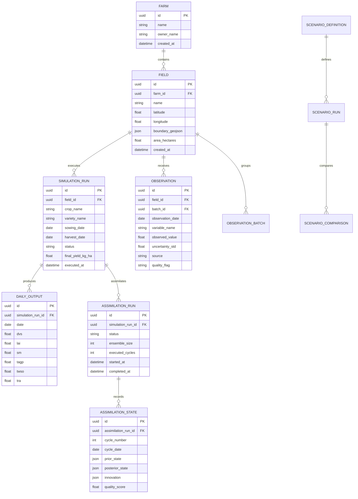

# 🗄️ Database Schema & Relational Models

## 1. Overview

AgriTwin utilizes **SQLAlchemy 2.0 ORM** with declarative mappings and **Alembic** for schema migrations. The schema is portable between SQLite (local lightweight testing) and PostgreSQL (production).

---

## 2. Entity Relationship Diagram



---

## 3. Core Relational Tables

### 3.1 `farms` & `fields`
- `farms`: Grouping entity for multiple fields under the same agricultural cooperative or grower.
- `fields`: Spatial entity storing polygon geometry in `boundary_geojson` (GeoJSON Polygon) with centroid `(latitude, longitude)`.

### 3.2 `simulation_runs` & `daily_outputs`
- `simulation_runs`: Master record of an execution containing configuration inputs (crop, variety, sowing date, irrigation events) and aggregate results (final yield, peak LAI, biomass).
- `daily_outputs`: High-resolution daily time series tracking all PCSE state and rate variables over the season.

### 3.3 `observations` & `observation_batches`
- `observations`: Atomic observation data points ingested from Sentinel-2, farmer smartphone scouts, soil sensors, or weather stations.
- `observation_batches`: Logical grouping of observation scenes with ingestion metadata and processing status.

### 3.4 `assimilation_runs` & `assimilation_states`
- `assimilation_runs`: High-level tracking record for closed-loop EnKF sequential assimilation cycles.
- `assimilation_states`: Complete audit log of every assimilation step (storing prior state, innovation vector $\mathbf{y} - \mathbf{H}\mathbf{x}^f$, Kalman Gain trace, and posterior state $\mathbf{x}^a$).

---

## 4. Database Migrations (Alembic)

Migrations are tracked in `alembic/versions/`.

```bash
# 1. Check current migration state
alembic current

# 2. Generate a new autogenerated migration after model changes
alembic revision --autogenerate -m "describe schema change"

# 3. Apply migrations to the database
alembic upgrade head

# 4. Rollback one migration
alembic downgrade -1
```
